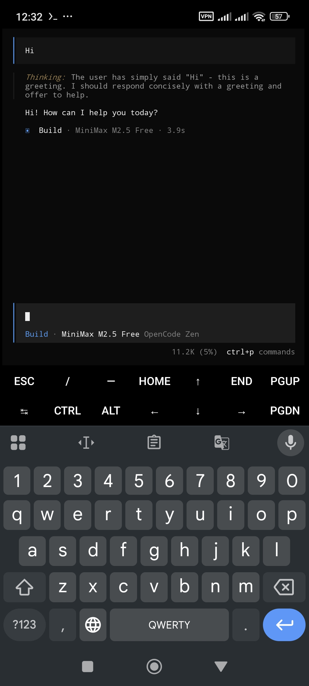
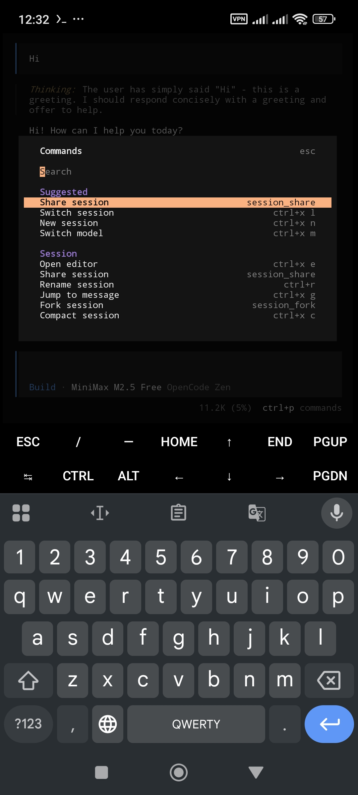
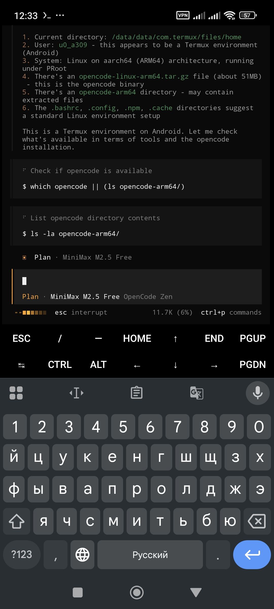
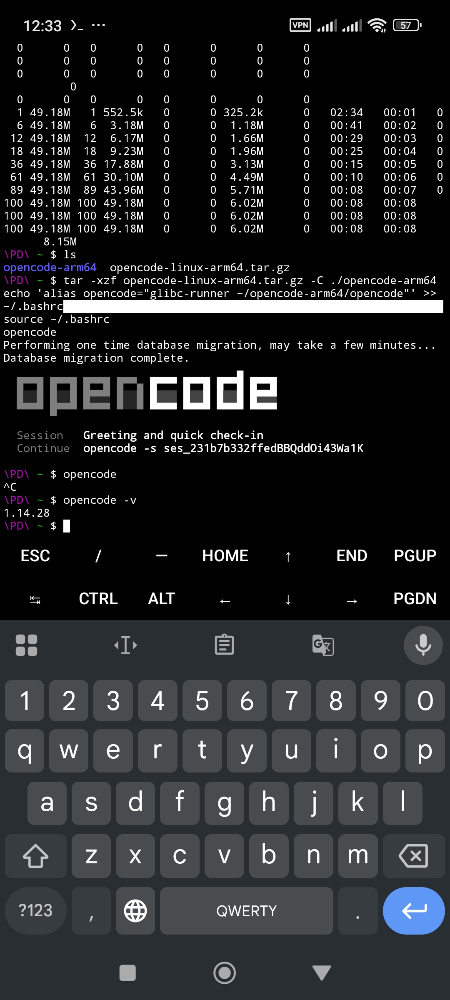

# opencode-android

> **OpenCode работает нативно в Termux — без proot, без эмуляции.**

Найдено методом проб и ошибок. Суть простая: используем `glibc-runner` из Termux репозитория чтобы запустить официальный Linux aarch64 бинарник opencode напрямую на Android.

---

## Скриншоты






---

## Быстрая установка (1 команда)

```bash
curl -fsSL https://raw.githubusercontent.com/N1V1LON/opencode-termux/main/install.sh | bash
```

После установки перезапусти оболочку и запускай:

```bash
exec zsh  # или exec bash
opencode
```

---

## Ручная установка (4 шага)

### 1. Установить glibc-runner

```bash
pkg install glibc-repo -y && pkg update -y && pkg install glibc-runner -y
```

### 2. Скачать бинарник opencode для arm64

```bash
curl -L -o opencode-linux-arm64.tar.gz https://github.com/anomalyco/opencode/releases/latest/download/opencode-linux-arm64.tar.gz
```

### 3. Распаковать

```bash
mkdir -p ~/opencode-arm64
tar -xzf opencode-linux-arm64.tar.gz -C ~/opencode-arm64
rm opencode-linux-arm64.tar.gz
chmod +x ~/opencode-arm64/opencode
```

### 4. Добавить алиас

Для **zsh** (по умолчанию в Termux):
```bash
echo 'alias opencode="glibc-runner ~/opencode-arm64/opencode"' >> ~/.zshrc
exec zsh
```

Для **bash**:
```bash
echo 'alias opencode="glibc-runner ~/opencode-arm64/opencode"' >> ~/.bashrc
source ~/.bashrc
```

### Запуск

```bash
opencode
```

---

## Как это работает

Официальный бинарник opencode для `linux-arm64` собран под glibc, которой нет в Termux (там Android Bionic libc). `glibc-runner` предоставляет нужный слой совместимости — и бинарник запускается без проблем прямо в Termux.

---

## Версии (проверено)

| Компонент | Версия |
|-----------|--------|
| opencode | 1.14.28 |
| glibc-runner | 2.0-3 |

Более новые версии opencode скорее всего тоже работают — бинарник скачивается по ссылке на `latest`.

---

## Требования

- Android 7+ (aarch64)
- Termux из [F-Droid](https://f-droid.org/packages/com.termux/) или [GitHub](https://github.com/termux/termux-app/releases) (**не** Google Play)
- ~150MB свободного места
- Интернет (~50MB для скачивания)

---

## Известные проблемы

- При первом запуске выполняется инициализация БД — это нормально, займёт несколько секунд
- Алиас нужно добавить в `.zshrc` / `.bashrc`, иначе после новой сессии запускать через `glibc-runner ~/opencode-arm64/opencode`

---

## Связанные проекты

- [anomalyco/opencode](https://github.com/anomalyco/opencode) — официальный репо opencode
- [guysoft/opencode-termux](https://github.com/guysoft/opencode-termux) — кросс-компиляция нативного Android бинарника (другой подход)
- [Charlie6F/opencode_termux_alpine_aarch64](https://github.com/Charlie6F/opencode_termux_alpine_aarch64) — запуск через proot Alpine

---

## Автор

[@N1V1LON](https://github.com/N1V1LON) — найдено и проверено на Xiaomi aarch64, Termux + zsh.
